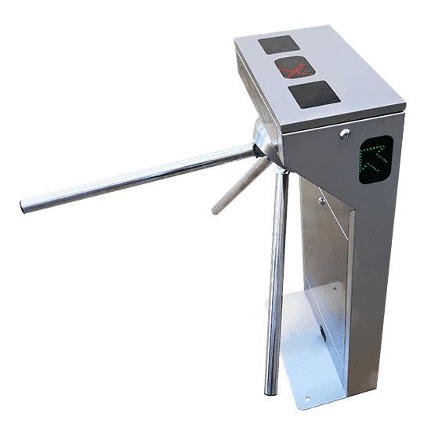

# Mooreovi avtomati

Projektno vsebuje implementacijo Mooreovih avtomatov, ki razširja implementacijo končnih avtomatov iz predavanj tako, da ima vsako stanje avtomata zdaj lahko še izhod.

## Matematična definicija

Mooreov avtomat je definiran kot nabor $(\Sigma, Q, q_0, F, \delta, O, G)$, kjer so:

- $\Sigma$ množica simbolov oz. abeceda,
- $Q$ množica stanj,
- $q_0 \in Q$ začetno stanje,
- $F \subseteq Q$ množica sprejemnih stanj,
- $\delta \colon Q \times \Sigma \to Q$ prehodna funkcija,
- $O$ množica izhodov (nizi) in
- $G \colon Q \times \Sigma \to O$ izhodna funkcija.

## Opis implementacije

Model razširja implementacijo končnih avtomatov iz predavanja.
Glavna sprememba je, da ima zapisni tip avtomata še polje za izhode. Ti so definirani kot par `(stanje, niz)`. Dodane so tudi funkcije, ki poskrbijo za izhode. Poleg tega so definicije različnih primerov definirane ločeno v `JSON` datotekah (datoteka `lib/from_json.ml`).

## Navodila za uporabo

Projekt zgradimo z ukazom `dune build` in nato poženemo tekstovni vmesnik z ukazom `dune exec moore_machine`.

## Primeri

### Turnstile machine (Vhod z vrtljivim križem)

Vrtljivi križ je na začetku zaklenjen, kar nam pove izhod na ekranu. Ko vstavimo kovanec `"k"`, se vrtljivi križ odklene. Odklenjen ostane, dokler ga ne potisnemo (vnesemo `"p"`), da preidemo skozi. Atvomat torej sprejema nize iz znakov `'p'` in `'k'`.

### Enke mod 3 = 1

Avtomat iz predavanj. Primer avtomata, ki nima podanih izhodov.
